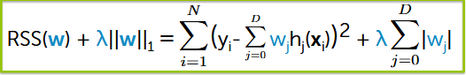
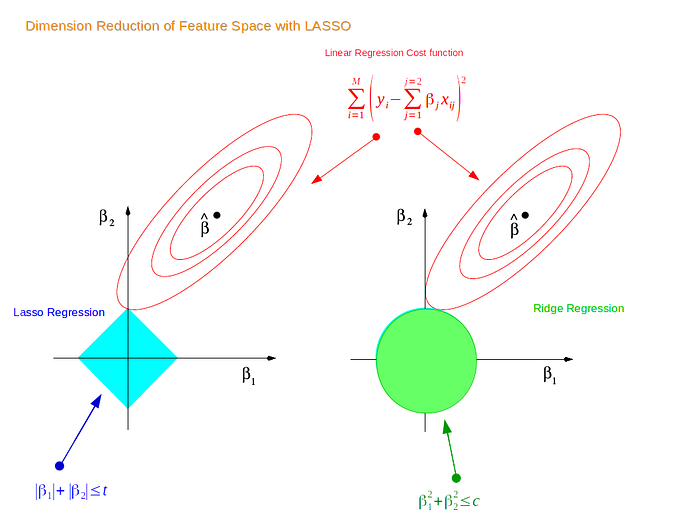

# Ridge vs Lasso: Implementation & Experimental Analysis

This project implements **ridge regression** and **lasso regression** from scratch using NumPy and compares their behavior on real and synthetic datasets. The focus is on understanding **regularization**, **optimization**, and **statistical learning** as presented in *Introduction to Statistical Learning (ISL)*. No external ML libraries are used for the core algorithms.

---

## Goals
- Implement ridge, and lasso cleanly from scratch.  
- Study how L1 and L2 regularization affect coefficient shrinkage, sparsity, and error.  
- Produce controlled experiments and clear visualizations that demonstrate these effects.  

---

## Core Components

### **1. Ridge Regression (L2)**

Include:
- configurable α  
- MSE evaluation  
- α sweep on a log scale  
- plots of **test error vs α** and **coefficient magnitudes vs α**

---

### **2. Lasso Regression (L1)**
Implemented with **coordinate descent**.

> **Reference:** [Coordinate Descent for Lasso Regression](https://xavierbourretsicotte.github.io/lasso_implementation.html#Implementing-coordinate-descent-for-lasso-regression-in-Python)

Include:
- soft-thresholding operator  
- α sweep  
- plot of **lasso coefficient paths**

---

### **3. High-Dimensional Synthetic Data**

Generate a dataset where:
- features p >> samples n  
- true coefficient vector is sparse  
- Gaussian noise is added  

Evaluate:
- ridge’s stability  
- lasso’s ability to recover the true sparse support

Notes:
- The results obtained by testing Lasso Regression & Ridge Regression on a synthetic dataset where p >> n show that Ridge Regression doesn't perform feature selection, which explains why it performs significantly worse than its counterpart Lasso, which is able to effective zero out a certain coefficient, thus reducing noise and properly selecting the relevant features. Although Ridge Regression is stable for certain datasets, it struggles when the true model is sparse

| Method | Strength | Weakness |
|--------|----------|----------|
| **Lasso (L1)** | Feature selection - finds sparse solutions | Can be unstable with correlated features |
| **Ridge (L2)** | Stable with correlated features | Cannot select features - uses everything |
